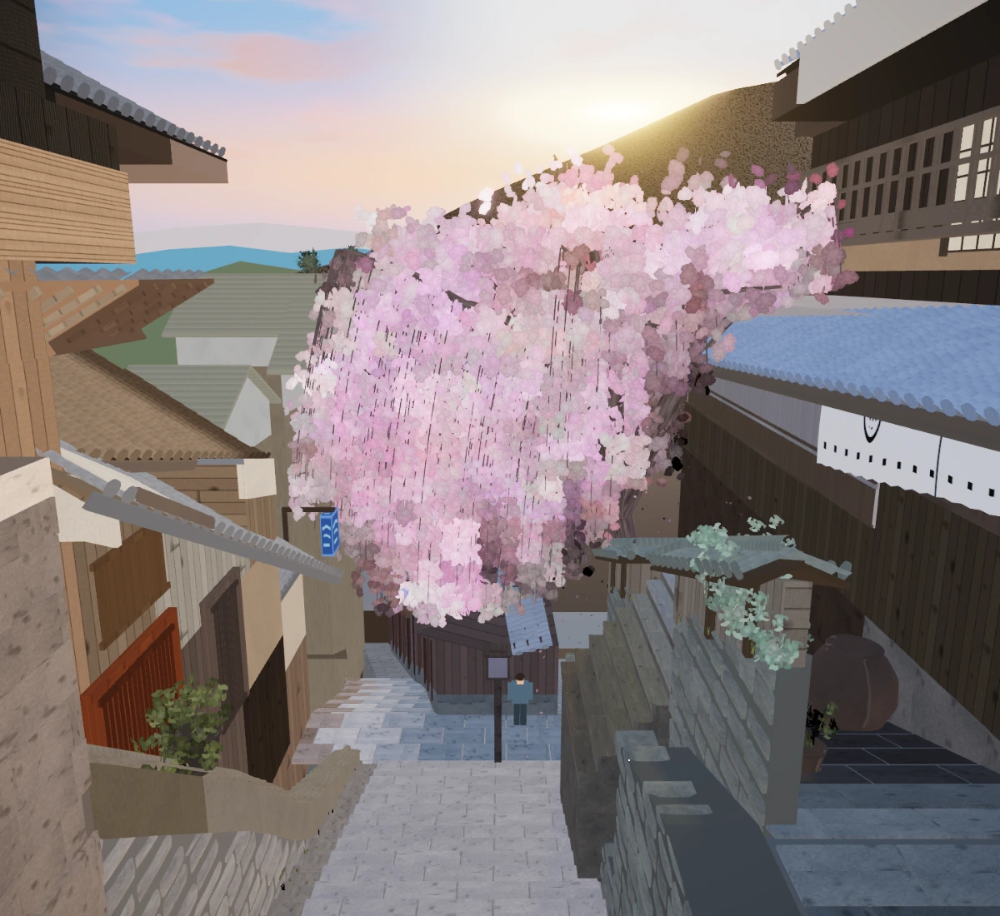

# scenes — a Kyoto street at sunset, rebuilt from one photograph

`japan.webp` is a photograph of a stepped street in Kyoto's Higashiyama district at sunset: a weeping cherry in full bloom over stone steps, machiya townhouses with kawara roofs on both sides, a forested hill and hazy mountains behind, the sun low behind the ridge.

`index.html` is that scene rebuilt in Three.js. It loads framed exactly like the photograph. Drag to orbit, scroll or pinch to zoom, and press `R` (or the button) to return to the photo view.

Everything in it is procedural. There are no downloaded models, no image assets beyond the photograph itself, and no build step: the page is `index.html` plus the modules in `src/`, and the only runtime download is a pinned copy of Three.js from a CDN.



The render above, against [the photograph](japan.webp) it was built from.

## Run it

```bash
npm run dev
```

Then open http://localhost:8080. Nothing is installed to view the scene; `npm install` is only needed for the gates below.

## The gates

The scene is held to the photograph by measurement, not by eye.

```bash
npm install
npx playwright install chromium
npm test
```

`npm test` renders the photo view, scores it against the photograph, checks that the right object is where the photograph says it is, and scores several frames across the animation cycle. Each step is also a command of its own:

| Command | What it does |
| ------- | ------------ |
| `npm run shot` | Renders the photo view at 1200x1100 to `out/render.png`. Fails on any console error, page error or failed request. |
| `npm run compare` | Scores `out/render.png` against `japan.webp` and writes `out/compare.png` (photo, render, 50% overlay, heat map), `out/overlay.png` and `out/scores.json`. |
| `npm run placement` | Two checks the scores cannot make: a ray through 19 photo positions that must hit the object belonging there, and 8 objects whose own base must sit on the ground they claim to stand on. |
| `npm run animation` | Scores the photo view at several points across the animation cycle, so a drift that only shows at t = 3 s cannot hide. |
| `npm run perf` | Median frame time and draw calls over 5 s at 1920x1080. Budget: under 16 ms and under 400 draw calls. |
| `npm run probe -- u,v ...` | Names the mesh under each photo position, and the pixel there. |
| `npm run inspect -- pair u0 v0 u1 v1` | Writes a photograph-versus-render crop of a region. |
| `npm run webp` | Encodes `out/render.png` as `docs/render.webp`. |

`npm run perf` is not part of `npm test` and is not run in CI: it measures the machine it runs on, and a shared runner without a GPU would produce a number unrelated to the budget.

## The scores

Two metrics, both computed by `npm run compare` (see `tools/lib/metrics.js` for what each can and cannot see):

- **Cell colour distance**: the mean distance between the photograph's and the render's average colour over a 24x22 grid of cells. Lower is better.
- **Grayscale SSIM** at 64 px wide. Higher is better.

| | Cell distance | SSIM |
| --- | --- | --- |
| First block-out (phase 1) | 0.1438 | 0.1368 |
| Architecture and stone (phase 2) | 0.0899 | 0.3273 |
| Vegetation and background (phase 3) | 0.0844 | 0.4159 |
| Light and atmosphere (phase 4) | 0.0820 | 0.4338 |
| Life and delivery (phase 5) | 0.0813 | 0.4385 |
| **Final** | **0.0813** | **0.4385** |

The thresholds the tests assert live in `docs/PLAN-scores.md`, along with every intermediate measurement and what moved it.

## How it is put together

| File | What lives there |
| ---- | ---------------- |
| `src/layout.js` | The camera model, every landmark's position in the photograph, and the colours sampled from it. The tools import this too, so the photograph's geometry has one home. |
| `src/scene.js` | Assembles the scene from the modules below. |
| `src/paving.js`, `walls.js`, `roofs.js`, `facades.js` | The street, the stone, the kawara roofs, the house fronts. Repeated pieces are instanced geometry, never painted on. |
| `src/vegetation.js`, `figures.js` | The cherry (spline limbs, hanging strands, about 30,000 instanced blossom cards), the pines, the ground plants, the person. |
| `src/background.js`, `sky.js` | The mountains, the hill, the far houses; the sky dome with the sun's glare and its clouds. |
| `src/lighting.js`, `materials.js`, `tonemap.js`, `post.js` | The light rig, the material factory, the tone curve and its inverse, and the post chain. |
| `src/animation.js` | The wind, the petals, the drift and the sway, and the clock the gates can pin. |
| `src/architecture.js` | What is still block-out: the roof undersides, the right house's roof mass, the paved bands of the right side. |
| `src/textures.js`, `instancing.js`, `primitives.js`, `random.js`, `photofield.js` | Procedural textures, instancing helpers, mesh helpers, the seeded random source, and the photograph's own colours over the canopy. |

Two ideas run through all of it. Every colour is a mean sampled from the photograph, and because the photograph's colours already contain the photograph's light, each material's albedo is derived by inverting the tone curve so the lit result lands back on the sampled mean. And the scene is built from fixed seeds, so the same render comes out every time.

`AGENTS.md` is the working brief; `docs/PLAN.md` is the plan the work followed; `docs/devlog/` records what was tried, what it measured, and what turned out to be false.

## Deployment

The page is static. `.github/workflows/ci.yml` runs `npm test` on every push to `main` and on pull requests: the runner has no GPU, so it renders through SwiftShader, which is what the scored shot has always used, and it reproduces the same scores this machine gets. It does not run `npm run perf`, and it shoots three animation frames instead of seven (`ANIMATION_FRAMES`), because a frame takes minutes on a shared runner.

`.github/workflows/pages.yml` publishes `index.html`, `src/`, the photograph and the render to GitHub Pages on the same pushes. **It needs Pages switched on once before it can deploy**: in the repository's Settings, under Pages, set the source to GitHub Actions. Until then the workflow fails with "Resource not accessible by integration", because a workflow token cannot create the site by itself. Note what deploying does: it serves `japan.webp`, a third-party photograph, from a public URL. See the licence note below before turning it on.

## Licence

The code is MIT (see `LICENSE`). The photograph `japan.webp` is not: it is a third-party image included only as the reference the gates measure against, and the licence explicitly carves it out. It is published with the page because the scene is meaningless without the thing it was matched to; if you fork this, that is the file to think about first.
